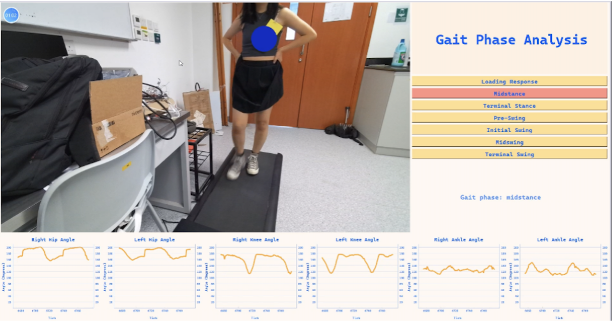

# Real-time Gait Analysis with 3D Augmented Reality Body Tracking

## Introduction

Gait analysis is a critical tool in clinical rehabilitation, offering valuable insights into human movement during walking and aiding in the assessment of functional limitations and impairments following injury, illness, or surgery. This project aims to develop a real-time gait analysis system using 3D augmented reality body tracking with the Microsoft Azure Kinect camera. The system utilizes machine learning to classify gait phases and provide personalized feedback and guidance during gait training sessions, enhancing the effectiveness of rehabilitation.

## Table of Contents

1. [Introduction](#introduction)
2. [Features](#features)
3. [Related Works](#related-works)
4. [Procedures](#procedures)
5. [Results](#results)
6. [Discussion and Conclusion](#discussion-and-conclusion)

## Features

- Real-time gait analysis using Microsoft Azure Kinect camera.
- Joint position tracking for hips, knees, and ankles.
- Machine learning-based gait phase classification.
- Personalized feedback and guidance during gait training.
- Potential applications in rehabilitation and research.

## Related Works

- Explore the effectiveness of the Microsoft Azure Kinect camera for gait analysis.
- Learn from previous studies on markerless depth capture and body tracking for clinical applications.
- Understand the potential of the Azure Kinect camera in capturing accurate 3D human skeletal data.

## Procedures

### Data Collection Procedure

- Utilize two Azure Kinect cameras for joint position tracking.
- Record data from healthy adult participants walking on a treadmill.
- Capture depth information and joint angles.

### Model Architecture and Gait Classification

- Employ three classifiers: k-nearest neighbors, decision tree, and random forest.
- Perform feature selection using scikit-learn's SelectKBest function.
- Hyperparameter tuning for each classifier.
- Train and test the model using joint angle data.

## Results

### Data Collection Results

- Display left hip, knee, and ankle angles across one gait cycle.
- Present the average range of motion for both subjects over one gait cycle.

### Machine Learning and Gait Classification Results

- Achieve an accuracy score of 91% on the test data with k-nearest neighbors.
- Followed by random forest with an accuracy of 90% and decision tree with an accuracy of 86%.
- The gait analysis program provides real-time gait phase predictions.

## Discussion and Conclusion

- Discuss the accuracy of gait phase prediction.
- Analyze the performance of joint angle measurements for hips, knees, and ankles.
- Suggest improvements for future work.

